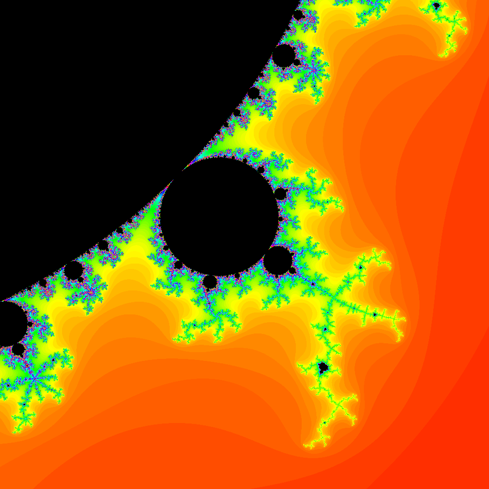

# mandelbrot-gen

Generate an image of the Mandelbrot set through the command line

usage:

run with `cabal run mandelbrot.cabal [image_dimension] [x] [y] [zoom]`

example:

```console
$ cabal run mandelbrot.cabal 1000 0.3 0.552 0.1823
```

generated image:



