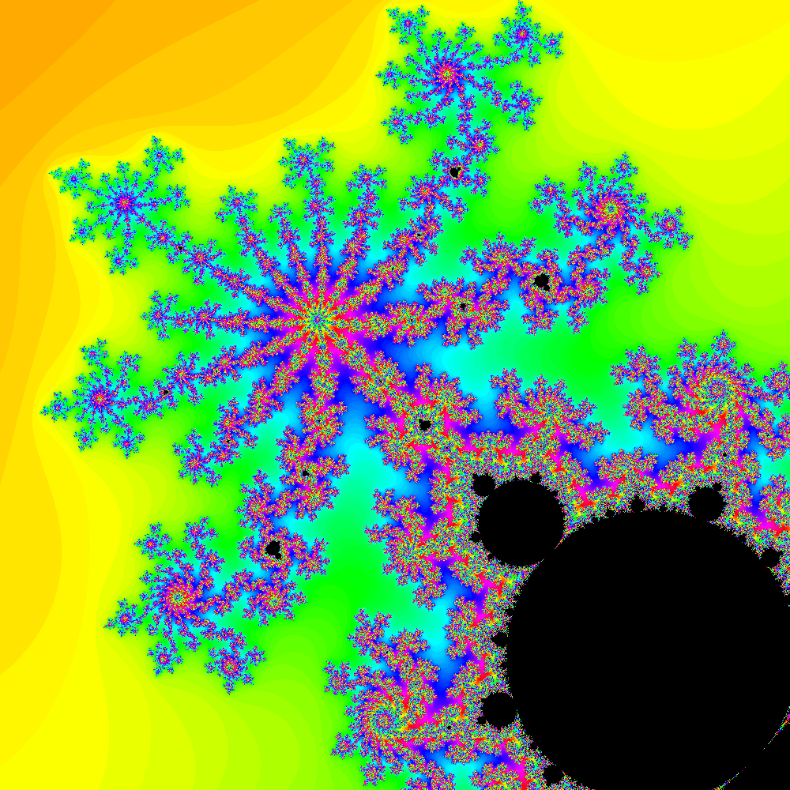
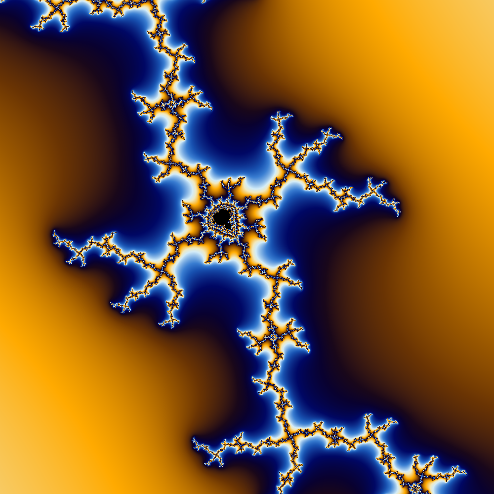

# examples


```console
$ cabal run exes -- -x -0.5762 -y -0.4849 -w 1000 -zoom 0.02 -o example.png
```

output:



---

```console
$ cabal run exes -- -x 0.36411 -y 0.66521 -zoom 0.004565 -w 1000 -color continous -o example1.png
```

output:


